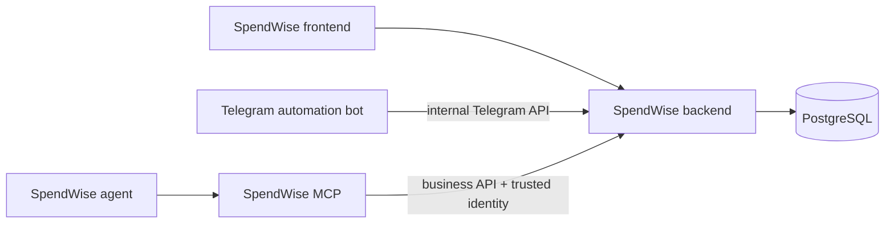

# SpendWise Backend

The backend is SpendWise’s central application service and source of truth. It owns user profiles, authentication and authorization, financial business rules, Telegram account linking and enrollment state, audit records, and durable persistence in PostgreSQL.

## Role in the system

The browser frontend calls backend APIs for user-facing SpendWise operations. The Telegram bot calls protected internal endpoints for Telegram authorization and enrollment. For authorized Telegram business operations, the MCP service calls backend APIs with a service credential and trusted Telegram identity. The backend resolves that Telegram identity to the SpendWise account and applies the same business rules and ownership checks as other clients.

## Responsibilities

- Authenticate browser users and issue access/refresh credentials.
- Enforce backend roles and scopes; the frontend’s role-based navigation is not an authorization boundary.
- Own SpendWise user identity and business data such as expenses, categories, budgets, recurring expenses, receipts, and analytics.
- Own Telegram invitation, claim, approval, active/blocked account mapping, and credential-setup state.
- Resolve authenticated Telegram service requests to the mapped SpendWise user; never accept an LLM-selected user identity.
- Persist application state and audit important administrative actions.

## Boundaries

Telegram webhook parsing and Telegram Bot API calls belong to `task-automation-bot`. Agent orchestration and natural-language interpretation belong to that bot/agent layer. `spendwise-mcp` exposes agent-facing business tools, not invitation or authorization tools. The frontend presents browser workflows but does not own security decisions or persistent authorization state.

The backend distinguishes browser JWTs, user API keys, MCP automation service credentials, and the bot’s Telegram internal-service credential. These credentials have separate purposes and must not be interchanged.

