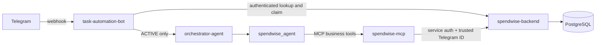

# Spendwise Backend

Spring Boot API for Spendwise, backed by PostgreSQL.

## Run with Docker

```bash
docker compose up --build
```

The API is available at `http://localhost:8080`. Copy `docker-compose.env.example` to `.env`, replace the placeholders with independent secrets and OAuth credentials, then start the Compose stack.

## Run locally

Requires Java and Maven. Configure the database and authentication settings in `src/main/resources/application.properties` or through environment variables, then run:

```bash
mvn spring-boot:run
```

## Telegram enrollment and authorization

The backend owns the Telegram-to-SpendWise identity mapping in `telegram_accounts` and one-time invite state in `telegram_invites`. JPA schema updates follow the existing `spring.jpa.hibernate.ddl-auto=update` convention in this repository; there is no Flyway/Liquibase migration system configured. Existing legacy `users.telegram_id` values are not silently treated as authorized; provision new mappings through an invitation.



Configure independent credentials for each connection:

- `SPENDWISE_TELEGRAM_SERVICE_TOKEN`: task-automation-bot to backend for authorization, invite claims, and memory.
- `SPENDWISE_AUTOMATION_SERVICE_TOKEN`: spendwise-mcp to backend for business API calls.
- `SPENDWISE_TELEGRAM_ADMIN_TOKEN`: administrator to backend invite management.

Keep all three distinct from the Telegram bot token. Also set `TELEGRAM_BOT_USERNAME` (without `@` is preferred) and optional `TELEGRAM_INVITE_EXPIRATION_MINUTES` (default 30).

```sh
curl -X POST http://localhost:8080/api/v1/admin/telegram/invites \
  -H 'Authorization: Bearer <admin-token>' \
  -H 'Content-Type: application/json'
```

The response contains a single-use `https://t.me/<BOT>?start=<TOKEN>` URL. Telegram delivers `/start <TOKEN>` to the bot webhook, and the bot submits a service-authenticated claim to the backend. The backend stores only the token hash and binds the invite to the first Telegram ID that claims it. The claim does not create an authorized account. Review claims with `GET /api/v1/admin/telegram/claims`; verify the Telegram identity out of band, then approve with `POST /api/v1/admin/telegram/claims/{inviteId}/approve` or reject with `/reject`. Approval creates the SpendWise user profile and active Telegram mapping transactionally. Until approval, that Telegram ID cannot reach the orchestrator or MCP. Revoke an unclaimed invitation with `POST /api/v1/admin/telegram/invites/{inviteId}/revoke` using the admin bearer token. Account blocking is available through the admin status endpoint.

Authorization is deliberately outside MCP: the webhook checks the backend before invoking any agent, and `/start` never reaches the LLM or MCP. Business requests carry Telegram identity from the trusted webhook context; the backend resolves it to the canonical SpendWise user ID.
